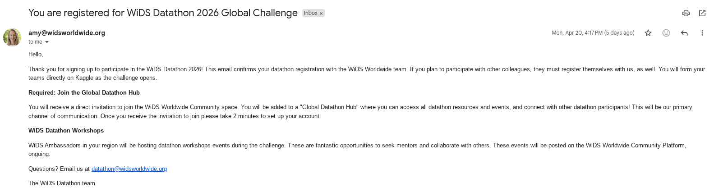

# WiDS Global Datathon 2026 — Wildfire Survival Prediction
### Project Progress Screenshots

**Team:** DeMarcus Crump · Chloe Tu · Akinbobola Akinpelu · Aima Ayaz

**Course:** Houston City College | ITAI 2377 Data Science in Artificial Intelligence | Spring 2026

**Competition:** WiDS Global Datathon 2026 | Kaggle — *"Predicting Wildfire Impact: From Infrastructure to Equity"*

---

## Overview

This document provides a visual record of the team's complete project journey — from initial registration for the WiDS Datathon and Kaggle competition, through data exploration and setup, to final public and private leaderboard scores. Screenshots are annotated with descriptions to give full context for each stage of the process.

---

## Section 1: WiDS Global Datathon 2026 — Official Registration

The WiDS (Women in Data Science) Datathon is an annual global challenge hosted in partnership with Kaggle. Registration for the WiDS Global Datathon 2026 was completed through the official Airtable form provided by WiDS Worldwide. The screenshots below document the full registration process.

---

### Figure 1 — WiDS Registration Form

**Description:** The official WiDS Global Datathon 2026 registration page hosted on Airtable. This form was used to formally enroll in the global competition and provide team information. Completing this step was required to gain access to the competition resources and be eligible for official standings.

---

### Figure 2 — End of Registration Confirmation

**Description:** The confirmation screen displayed immediately after successfully submitting the WiDS registration form. This screen confirms that the registration was received and that the team is now enrolled in the WiDS Global Datathon 2026.

---

### Figure 3 — Email Confirmation of Registration

**Description:** The official confirmation email received from WiDS Worldwide after completing the registration process. This email serves as the formal record of enrollment in the 2026 competition and provides important competition information including rules, timeline, and links to the Kaggle competition page.

---

## Section 2: Kaggle Competition — Registration & Setup

The WiDS Global Datathon 2026 is hosted on Kaggle. The screenshots below document our team's Kaggle competition registration, the dataset we worked with, and our data exploration process.

---

### Figure 4 — Kaggle Competition Overview

**Description:** The main WiDS Global Datathon 2026 competition page on Kaggle. This page shows the competition title ("Predicting Wildfire Impact: From Infrastructure to Equity"), the competition type (a predictive modeling challenge), and key details including the timeline, prize information, and evaluation metric (Concordance Index / C-index). The competition required participants to predict the cumulative probability that an active wildfire reaches a community evacuation zone within 12, 24, 48, and 72 hours.

---

### Figure 5 — Kaggle Team Registration

**Description:** The Kaggle team registration confirmation for our team. This screenshot confirms that all team members were successfully enrolled as official competition participants on Kaggle. Teams were required to register officially before submissions could be made to the leaderboard.

---

### Figure 6 — Kaggle Data Description

**Description:** The data description page from the Kaggle competition. This page documents every feature column in the dataset — including sensor readings such as `closing_speed_m_per_h` (how fast the fire is approaching the community), `alignment_cos` (the cosine of the angle between the fire's trajectory and the direction to the zone), `area_growth_rate_ha_per_h` (how fast the fire perimeter is expanding), and `dist_accel_m_per_h2` (acceleration of the fire front). Understanding these columns was essential for our physics-based feature engineering approach.

---

### Figure 7 — Kaggle Data Download via CLI

**Description:** Screenshot of the Kaggle CLI (Command Line Interface) being used to programmatically download the competition dataset files (`train.csv` and `test.csv`). The data was downloaded directly into the `data/raw/` folder of the project repository. Using the Kaggle CLI ensures a reproducible and clean download process without manual intervention.

---

### Figure 8 — Training Dataset View

**Description:** A view of the training dataset (`train.csv`) as displayed in the Kaggle competition interface. The training set contains **221 fire trajectory records**, each representing a single wildfire event with associated sensor readings and labels. The `event` column indicates whether the fire reached the community zone (True/False), and `time_to_hit_hours` records when. Approximately **31.2%** of fires in the training set are positive events (hits).

---

### Figure 9 — Test Dataset View

**Description:** A view of the test dataset (`test.csv`) as displayed in the Kaggle competition interface. The test set contains **95 fire trajectories** for which no outcome labels are provided. The model must predict the probability of impact at each time horizon (12h, 24h, 48h, 72h) for each test fire. These predictions are submitted to Kaggle, where they are scored against the hidden ground truth.

---

## Section 3: Public Leaderboard Submissions

The Kaggle public leaderboard was evaluated against a **subset** of the test data during the competition. Public scores give a real-time signal of model performance but may differ from the final private score.

---

### Figure 10 — Submission History (Public Leaderboard)

**Description:** The full public leaderboard submission history for our team on Kaggle. Each row represents one submission of `final_submission.csv`, with the associated public C-index score and timestamp. The public leaderboard was computed on a randomly selected portion of the test data, reflecting partial performance. Our submission strategy focused on honest cross-validated model selection rather than iteratively overfitting to the public leaderboard — consistent with scientific best practice.

---

## Section 4: Private Leaderboard — Final Score

After the competition deadline, Kaggle revealed the **private leaderboard** — computed on the full test set, including the previously hidden portion. The private score is the true final measure of performance.

---

### Figure 11 — Private Leaderboard Final Score

**Description:** The final private leaderboard score for our team revealed after the WiDS Global Datathon 2026 competition closed. This score was computed on the complete test set and represents the definitive evaluation of our model's generalization ability. Our approach — using Survival Analysis with physics-informed features and honest Stratified K-Fold validation — was designed to produce a model that generalizes reliably, rather than one that appears strong only on the public leaderboard.
